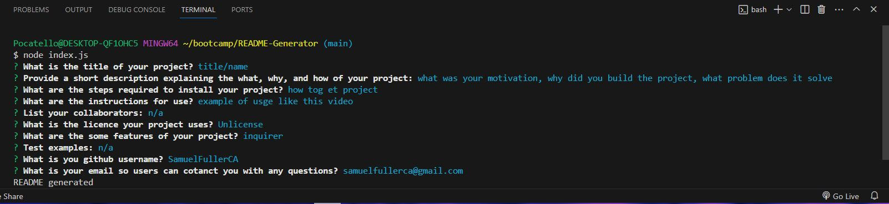

# README Generator

  *this readme was made using this README generator*

  

  ## Description

  An application that generates a professional README to help spead up a project of application by giving the user a formal and structure for a procfessional readme they can fill out by awnsering prompted questions.

  ## Table of Contents

  - [Installation](#installation)
  - [Usage](#usage)
  - [Credits](#credits)
  - [License](#license)

  ## Installation

  Dowload, copy, or clone the code to your local machiene through github. When the code is launched in vscode, or another approperate IDE, open an terminal on the index.js file and type "node index.js" to begin theapplication.

  ## Usage

  Vide demonstration of usage:  https://www.youtube.com/watch?v=SD52vVrABCc

   After following the installation steps the user will then be prompted a series of questions about their project/application. Once all questions are awnsered a markdownfile will be generated in the format of a professional README with the users prompt inputs.

   

  ## Credits 

  n/a

  ## License

  This application is covered under Unlicense license.

  ## Features

  This applciation features the use of node.js, specifically Inquirer 8.2.4 to prompt the user with a variety of questions in the terminal. Aditionally it uses fs to write files based on the users input from Inquirer.

  ## Tests

  n/a

  ## Questions
  Any questions please reachout at: samuelfullerca@gmail.com
  
  To view additional applications developed by myself, checkout my GitHub profile: SamuelFullerCA
